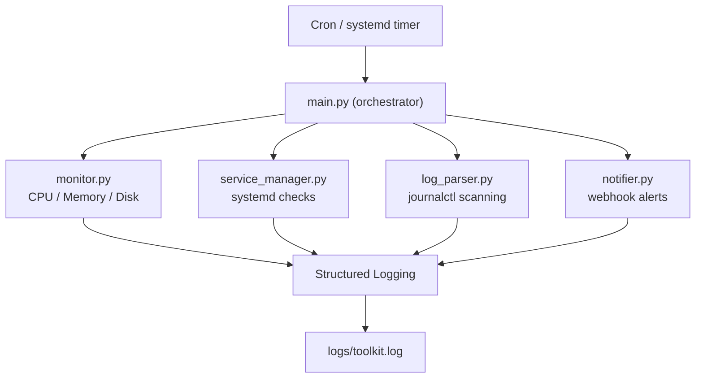

# Linux Reliability Toolkit

## Overview
A Python-based reliability monitoring tool that checks system health, detects service failures, parses system logs, and sends alerts when issues are detected.

## Features
- CPU usage monitoring
- Memory usage monitoring
- Disk usage monitoring
- Systemd service health checks
- Automatic service restart
- Journalctl log scanning
- Webhook alerting
- File and console logging
- systemd service integration
- Cron-based scheduling

## Tech Stack
- Python
- psutil
- systemd
- journalctl
- cron
- requests
- YAML configuration

## Project Structure
```
linux-reliability-toolkit
│
├── toolkit/                 # Core application code
│   ├── __init__.py
│   ├── main.py              # Application entry point
│   ├── monitor.py           # CPU, memory, disk monitoring
│   ├── service_manager.py   # systemd service checks and restart logic
│   ├── log_parser.py        # journalctl log scanning
│   ├── notifier.py          # webhook alerting
│   └── utils.py             # shared helper functions
│
├── logs/                    # Runtime log files
│
├── systemd/                
│   └── reliability-toolkit.service     # systemd service definition
│
├── cron/                   
│   └── reliability-cron         # cron scheduling configuration
│
├── incident_reports/        # Failure simulation documentation
│   └── disk_full_simulation.md
│
├── docs/                    # Additional documentation
│
├── config.yaml              # Application configuration
├── requirements.txt         # Python dependencies
├── README.md                # Project documentation
└── .gitignore
```

## Architecture



## Setup
Clone the repository:

```bash
git clone https://github.com/VeeraReddyRavuri/linux-reliability-toolkit.git
cd linux-reliability-toolkit
```

Create a virtual environment:

```bash
python3 -m venv venv
```

Activate it:

```bash
source venv/bin/activate
```

Install dependencies:

```bash
pip install -r requirements.txt
```

## Running the Tool
```bash
python -m toolkit.main
```

## Failure Simulation
A disk-full scenario was simulated to verify that the monitoring tool detects high disk usage and logs an alert.

See the detailed incident report:
[Disk Full Simulation Report](incident_reports/disk_full_simulation.md)

## Future Improvements
- Prometheus metrics
- Systemd timer instead of cron
- Log pattern detection
- Alert throttling