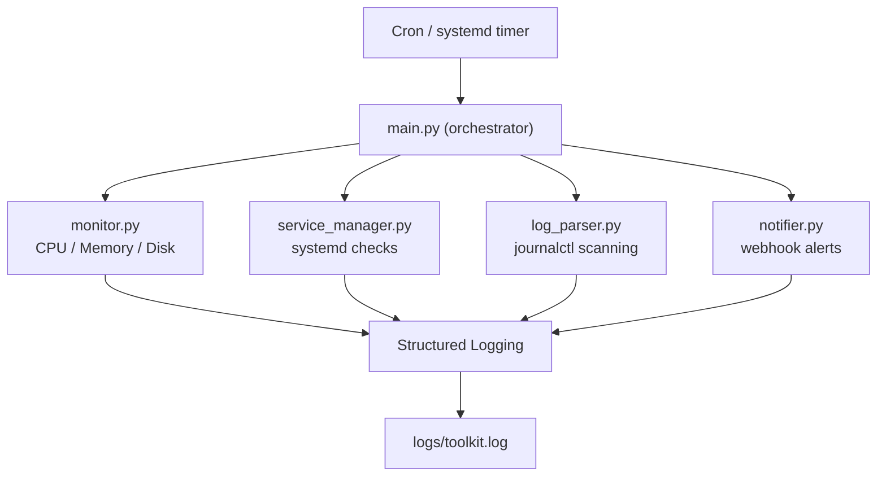

# Linux Reliability Toolkit

**Version:** v1.0.0

A lightweight Python-based system health monitor that detects failures, attempts recovery, and logs incidents.

## Demo

Example run:

```
python -m toolkit.main

026-03-10 04:30:29,566 | INFO | Configuration loaded successfully
2026-03-10 04:30:30,567 | INFO | CPU usage: 0.3%
2026-03-10 04:30:30,568 | INFO | Memory usage: 28.8%
2026-03-10 04:30:30,568 | INFO | Disk usage: 0.4
2026-03-10 04:30:30,573 | WARNING | Service cron is not active. Attempting restart..
2026-03-10 04:30:30,580 | ERROR | Failed to restart service cron: Permission denied or insufficient privileges
2026-03-10 04:30:30,603 | WARNING | Recent error logs detected
```

## Overview
A Python-based reliability monitoring tool that checks system health, detects service failures, parses system logs, and sends alerts when issues are detected.

## Design Goals

This project demonstrates reliability engineering fundamentals:

- Detect system resource exhaustion
- Identify failed services
- Attempt automated recovery
- Capture operational logs
- Surface failure conditions clearly
- Document incidents and root causes

## Features
- CPU usage monitoring
- Memory usage monitoring
- Disk usage monitoring
- Systemd service health checks
- Automatic service restart
- Journalctl log scanning
- Webhook alerting
- File and console logging
- systemd service integration
- Cron-based scheduling

## Tech Stack
- Python
- psutil
- systemd
- journalctl
- cron
- requests
- YAML configuration

## Project Structure

```
linux-reliability-toolkit
│
├── toolkit/                     # Core application modules
│   ├── __init__.py
│   ├── main.py                  # Application entry point
│   ├── monitor.py               # CPU, memory, disk monitoring
│   ├── service_manager.py       # systemd service checks and restart logic
│   ├── log_parser.py            # journalctl log scanning
│   ├── notifier.py              # webhook alerting
│   └── utils.py                 # helper utilities
│
├── logs/                        # runtime logs generated by the toolkit
│
├── systemd/
│   └── reliability-toolkit.service     # systemd service definition
│
├── cron/
│   └── reliability-cron         # cron scheduling configuration
│
├── docs/
│   └── architecture.md          # system architecture documentation
│
├── incident_reports/            # Failure simulation documentation
│   ├── disk_full_simulation.md
│   ├── service_restart_failure.md
│   ├── service_restart_permission_failure.md
│   └── log_corruption_simulation.md
│
├── config.yaml                  # Application configuration
├── requirements.txt             # python dependencies
├── README.md                    # Project documentation
└── .gitignore
```

## Architecture



## Setup
Clone the repository:

```bash
git clone https://github.com/VeeraReddyRavuri/linux-reliability-toolkit.git
cd linux-reliability-toolkit
```

Create a virtual environment:

```bash
python3 -m venv venv
```

Activate it:

```bash
source venv/bin/activate
```

Install dependencies:

```bash
pip install -r requirements.txt
```

## Running the Tool
```bash
python -m toolkit.main
```

## Failure Simulation

The toolkit was tested under multiple failure scenarios to verify detection, recovery behavior, and failure logging.

### Disk Exhaustion Simulation
A large file was created to artificially increase disk usage beyond the configured threshold.  
The monitoring tool detected the condition and logged a warning.

[Disk Full Simulation Report](incident_reports/disk_full_simulation.md)

### Service Failure Detection
The `cron` service was manually stopped to simulate a service crash.  
The toolkit detected that the service was inactive.

[Service Restart Failure Report](incident_reports/service_restart_failure.md)

### Service Restart Permission Failure
When the toolkit attempted to restart the failed service, the restart failed because the script was executed without sufficient privileges.  
The error was captured and logged correctly.

[Service Restart Permission Failure Report](incident_reports/service_restart_permission_failure.md)

### Log Corruption Simulation
When random binary log entries were injected into the system journal using ```logger "$(head -c 100 /dev/urandom | base64)"``` to simulate corrupted or unexpected log data, the toolkit does not parse logs using fragile patterns.
It safely captures journal output and logs it without crashing.

[Log Corruption Simulation Report](incident_reports/log_corruption_simulation.md)

## Skills Demonstrated

Linux Operations
- systemd service management
- journalctl log inspection
- cron scheduling
- process monitoring

Python Automation
- subprocess for system integration
- structured logging
- YAML configuration
- modular architecture

Reliability Engineering
- automated service recovery
- failure simulation
- incident reporting

## Future Improvements
- Prometheus metrics
- Systemd timer instead of cron
- Log pattern detection
- Alert throttling

## Limitations

- The toolkit currently monitors only the root filesystem (`/`) for disk usage.
- Service restart attempts require root privileges. When the tool runs as a non-root user, restart operations will fail.
- Log scanning relies on simple `journalctl` filtering and does not perform advanced pattern analysis.
- Webhook alerting is basic and does not implement retry logic or alert throttling.
- Metrics are logged but not stored historically for trend analysis.