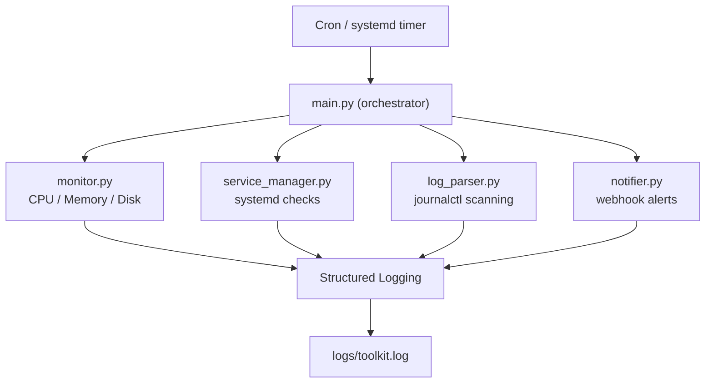

# Architecture Diagram

## Flow

1. Scheduler triggers the tool.
2. `main.py` orchestrates all checks.
3. Monitoring module collects system metrics.
4. Service manager verifies systemd services.
5. Log parser scans journalctl for errors.
6. Notifier sends alerts when issues are detected.
7. All actions are logged.