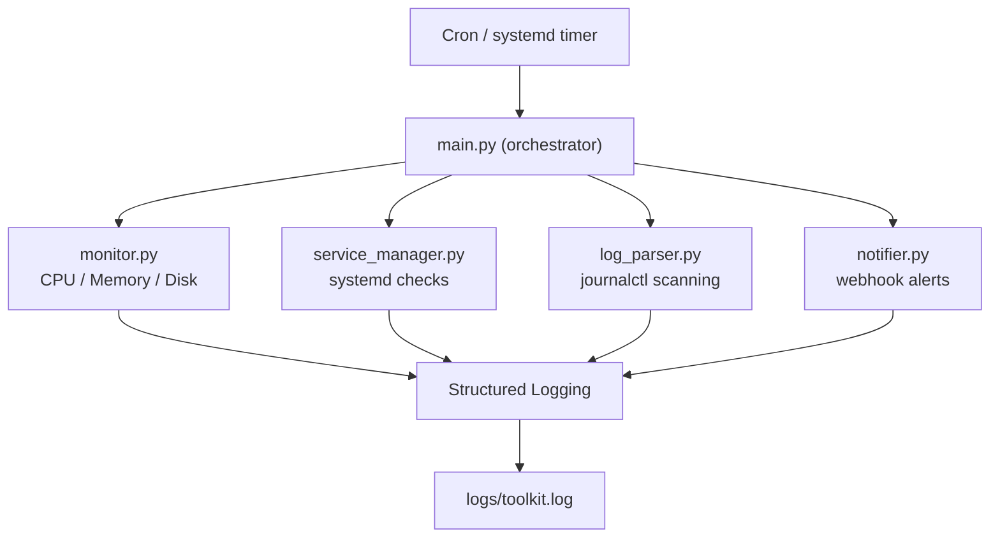

# Architecture Diagram

## Module Responsibilities

### main.py
Acts as the orchestrator. It loads configuration, initializes logging, and coordinates all monitoring and alerting modules.

### monitor.py
Collects system health metrics including CPU, memory, and disk usage using the `psutil` library.

### service_manager.py
Checks the status of systemd services using `systemctl` and attempts automatic restart if a service is not active.

### log_parser.py
Scans system logs using `journalctl` to detect recent errors or failures.

### notifier.py
Sends alerts to external systems via webhook when issues are detected.

### logging
All actions and detected issues are written to structured logs stored in `logs/toolkit.log`.

## Execution Flow

1. Scheduler (cron or systemd) triggers the reliability toolkit.
2. `main.py` loads configuration and initializes logging.
3. System health metrics (CPU, memory, disk) are collected.
4. Configured systemd services are checked for failures.
5. Failed services are restarted automatically.
6. System logs are scanned for recent error events.
7. If issues are detected, alerts are sent via webhook.
8. All events are recorded in structured logs.

## Design Decisions

### YAML Configuration
All operational thresholds and monitored services are stored in `config.yaml` to separate configuration from application logic.

### Modular Architecture
Each responsibility (monitoring, service management, log parsing, alerting) is separated into independent modules to improve maintainability and testability.

### Structured Logging
The Python `logging` module is used instead of print statements to enable structured, production-style logging.

### Subprocess for System Interaction
System utilities like `systemctl` and `journalctl` are executed using Python's `subprocess` module to integrate Linux system behavior directly into the toolkit.

## Design Trade-offs

### Cron vs systemd timers
The project uses cron for scheduling because it is simple and widely available.  
systemd timers provide tighter integration with system services but add complexity for a small monitoring tool.

### Simple log scanning vs deep log parsing
The toolkit uses `journalctl` filtering instead of complex parsing logic.  
This approach is more resilient to malformed logs but provides less detailed log analysis.

### YAML configuration vs environment variables
Configuration is stored in `config.yaml` because it supports structured values such as service lists and thresholds.  
Environment variables are better for flat key-value configuration but less convenient for structured data.

### Direct system commands vs Python libraries
System interactions such as service checks and log retrieval use `systemctl` and `journalctl` through `subprocess`.  
This ensures behavior matches how administrators interact with the system but requires the tool to run on Linux systems with systemd.